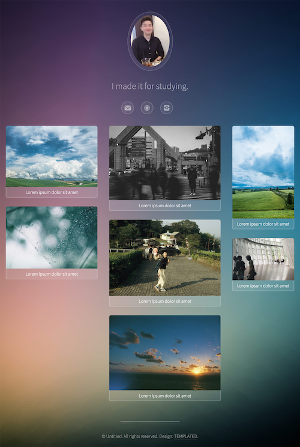

# Templated-visualize

생활코딩의 수업을 따라하여 만들어보았습니다.

[사진 중심의 웹사이트 만들기 - 생활코딩](https://www.opentutorials.org/course/2473/13815)

아래의 사이트를 참고하여 카피를 하는 내용입니다.

​	https://templated.co/visualize

제가 만든 결과물은 아래의 링크로 들어와주세요!

下記のリンクをクリックしてください！

https://yoodahun.github.io/templated-visualize/

여기에서 쓰인 사진은 제가 찍은 것들입니다.

